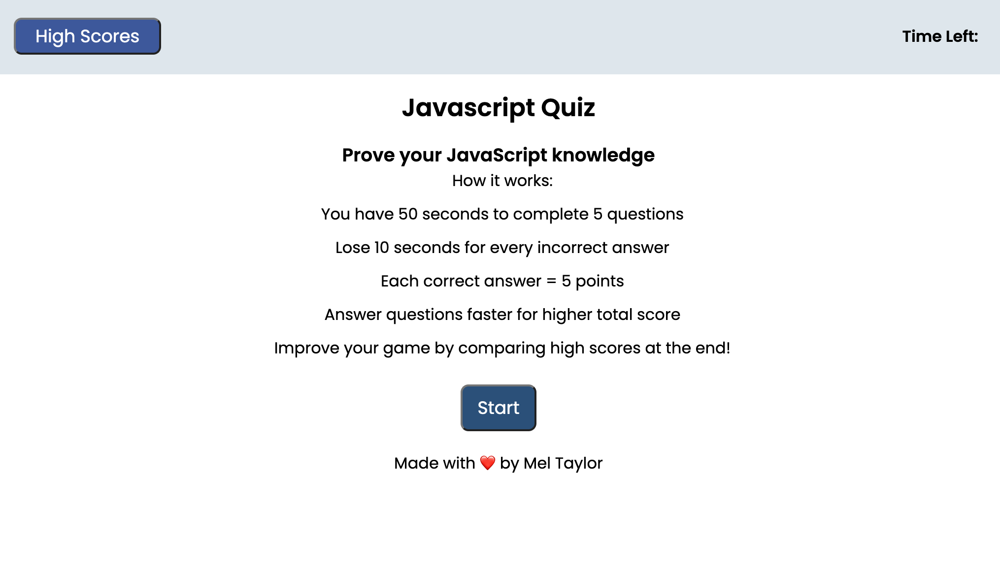
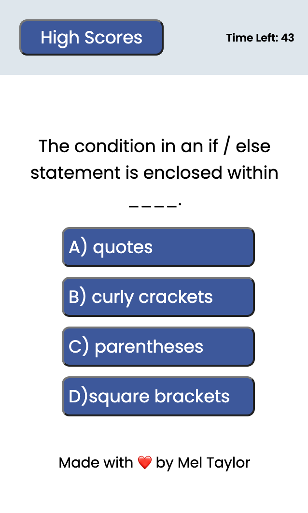
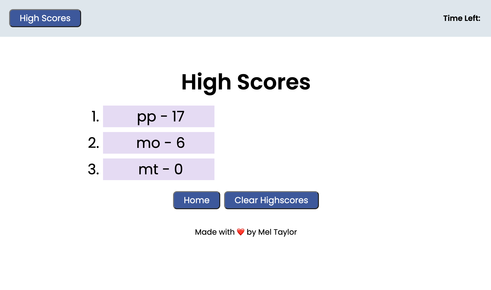
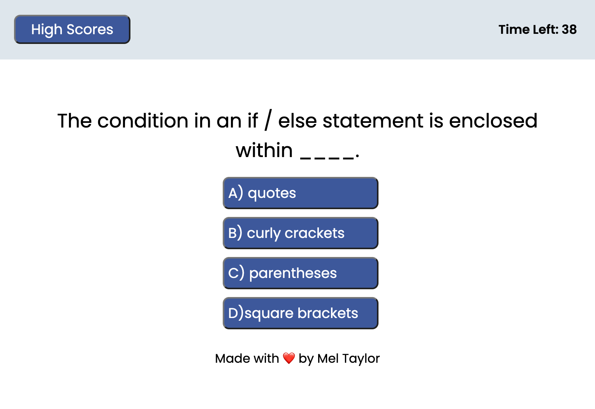

# Test-Your-Knowledge_JavaScript
Think you know Javascript? Prove it with this Javascript Quiz powered by web APIs!
January 23rd, 2023

# Deployment Link

https://melissataylor1.github.io/Test-Your-Knowledge_JavaScript/

# Description

This was the first experience using local storage and other web apis to build an application. There was difficulty with storing high scores, and getting the timer to change dynamically with the quiz answers. Overall, I learned a lot from this challenge in particular. 

### What did this project ask of us? 

This project asked stupdents to build a timed quiz on JavaScript fundamentals that stores high scores, so that users may gauge progress and compare to peers. Answer incorrectly? The timer goes down by 10 seconds. Answer correctly, and your score goes up! If timer runs out, quiz is over. When quiz is done, you can enter your intials to save your high score!

This app will run in the browser, and will feature dynamically updated HTML and CSS powered by JavaScript code.

It will have a clean, polished, and responsive user interface. 

# Screenshot
Here are various screenshots of my finished site page.

### Homepage View

### Mobile View

### Highscore View

### Questions Page

# Liscenses/Credits

The MIT License (MIT)
